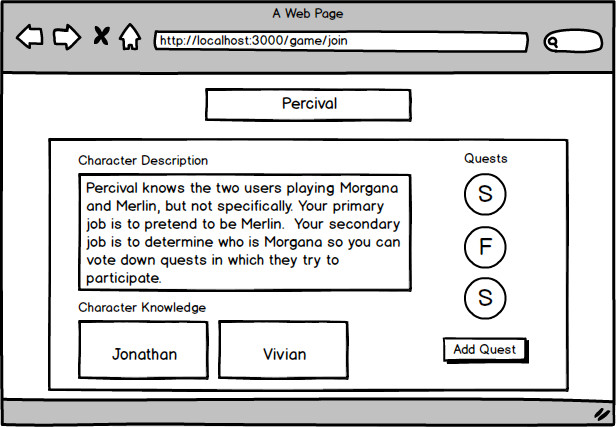

# Avalon Assistant

## Overview

My friends and I played a game called The Resistance: Avalon over spring break, and we had a lot of fun.

"The Resistance: Avalon pits the forces of Good and Evil in a battle to control the future of civilization. Arthur represents the future of Britain, a promise of prosperity and honor, yet hidden among his brave warriors are Mordred's unscrupulous minions. These forces of evil are few in number but have knowledge of each other and remain hidden from all but one of Arthur's servants. Merlin alone knows the agents of evil, but he must speak of this only in riddles. If his true identity is discovered, all will be lost."

However, the one thing that wasn't so ideal about the game was that because select characters needed to know of people playing specific characters while others needed to stay without that information, every game started off with all of us closing our eyes and someone reading off instructions for select characters to raise their thumb or open their eyes.

Avalon Assistant is a web app that will allow a group of players to create a session that assigns characters and gives select characters the information they need. It will also let users minimally keep track of the quest progression (successes/fails) and the people who went on each quest.

## Data Model

The application will store Games, Users, Characters, and Quests.

* Games can have multiple Quests (by embedding)

An Example Game with Embedded Quests:

```javascript
{
  gameID: "test game",
  gameSlug: "test-game",
  //an array of player objects that stores player names and the characters they are playing
  players: [
    {
      name: "avalonplayer1",
      character: "Merlin"
    }
    {
      name: "avalonplayer2",
      character: "Mordred"
    }
  ]
  quests: [
    { 
      numOfPlayers: "2", 
      players: [
        "avalonplayer1",
        "avalonplayer2" 
      ], 
      success: true,
      questNum: 'Quest 1'
    },
    { 
      numOfPlayers: "3", 
      players: [
        "avalonplayer1",
        "avalonplayer2",
        "avalonplayer3"
      ], 
      success: false,
      questNum: 'Quest 2'
    }
  ]
}
```

An Example User:

```javascript
{
  name: "avalonplayer",
  googleID: "googleID",
  provide: "google";
}
```

An Example Character:

```javascript
{
  name: "avaloncharacter",
  description: //description of character and who the character gets to know
  knowledge: //an array of character names that the character can know
  allegiance: // string detailing if the character is good, bad, or neither
  select: // boolean to allow generic characters to have a select option so that more than one can be added to a game
}
```

## [Link to Commented Schemas](db.js) 

## Wireframes

/game/host - page for creating/hosting a new game


/game/join - page for users to join a game being hosted


/game/play - page showing users their assigned character


/game/quest/add - page for adding quest results to current game


/game/quest/slug - page for showing stored quest results


## Site map


## User Stories or Use Cases

1. as non-registered user, I can register a new account with the site
2. as a user, I can log in to the site
3. as a user, I can create/host a game
4. as a user, I can join a existing game with a game ID
5. as a user, I can see data for the character I am playing
6. as a user, I can see quest data for the current game

## Research Topics

* (4 points) Integrate user authentication
    * I'm going to be using passport-google-oath for user authentication
* (4 points) Perform client side form validation using validate.js
    * I'm going to have client side form validation for adding quests and creating new games.
* (2 points) Bootstrap
    * I'm going to use Bootstrap to style the website

10 points total out of 8 required points.

## [Link to Main Project File](app.js) 

## Annotations / References Used

1. [passport.js authentication docs](http://passportjs.org/docs) 
    - [link to source code using passport.js](app.js#L45-L102)
2. [validate.js validation docs](https://validatejs.org/) 
    - [link to source code using validate.js](public/lobbyValidate.js)
3. [tutorial on Bootstrap](https://getbootstrap.com/docs/4.1/components/alerts/) 
    - Bootstrap used on entire website